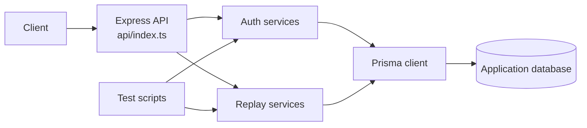

# Chronos

Chronos is a TypeScript/Express service for recording and replaying authenticated application activity. It uses Prisma for persistence and includes focused scripts for auth and replay behavior.

## Requirements

- Node.js
- A configured database supported by the Prisma schema

## Setup

```bash
npm install
npx prisma generate --schema db/schema.prisma
```

Create the environment values expected by `api/` and the Prisma schema before starting the service.

## Commands

```bash
npm run dev
npm run build
npm start
npm run prisma:generate
npm run prisma:migrate
npm run test:auth
npm run test:replay
```

The development server runs from `api/index.ts`; production starts the compiled `dist/api/index.js`. Keep generated Prisma output and local environment files out of commits.

## Architecture


